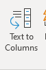
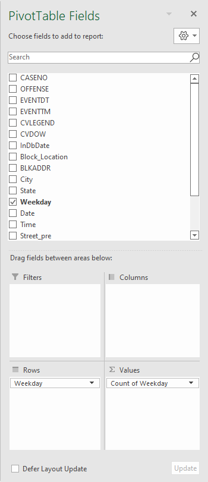

# Description

According to 2019 University of California - Berkeley Crime & Safety Report, UCB reported 1,057 crime incidents happened on campus and near campus. Every day we received at least one Berkeley Warn Me email from UCPD. It is not surprising that we could receive another Warn Me email while reading this report. The frequent occurring of these tragic events shall not be ignored since each event represents at least one person involved in the incident was harmed. Most importantly, this is a reminder and an alarm for us to avoid the danger.

Even though we received these notifications almost every day, how can we conclude the crime activities in Berkeley? How can we convert these numbers to something visualizable?

In this report, we will see at what period of the time would have the highest crime rate and at where crimes were frequently happening. With the result, we will understand where to position more patrols and when to avoid specific areas.

# Source
In the project, I used [Berkeley PD Calls for Service](Berkeley_PD_-_Calls_for_Service_original.csv) from 9/19/2021 to 3/17/2022, sourced from [City of Berkeley Open Data](https://data.cityofberkeley.info/Public-Safety/Berkeley-PD-Calls-for-Service/k2nh-s5h5).

## Potential Interview Contacts
1. Zhuowen Chen, a UCB CS student
    * email: siakmun@berkeley.edu
    * description:  Zhuowen recently encountered car thefts and suffered from properties loss when he parked his car at Telegraph ave at around 7pm Saturday night.
2. Sabrina Reich, UCPD Lieutenant
    * email: sreich@berkeley.edu
    * phone number: (510) 642-4832
    * description: Sabrina Reich aimed to strengthen campus security by providing more police patrols in the appropriate areas. Also, she advocated to raise students' consciousness of the significance of protecting their personal property and being safe. 

## Additional Source
1. [Crimemappping](https://www.crimemapping.com/map/location/Berkeley,%20CA,%20USA?id=dHA9MCNsb2M9MzAwMjgyOCNsbmc9MzQjcGw9NjI0MzczI2xicz0xNDo4Mzk2NTc0#)
    * This is a real-time map that records all types of crimes happened recently.Using this, we can get the exact location/time of the crime occurence.
2.  [2021 Berkeley Crime Report](https://berkeleyca.gov/sites/default/files/2022-04/2022-03-08%20Item%2022%202021%20Year%20End%20Crime%20and%20Collision%20Data.pdf)
    * This is a detailed crime report showing how crime activities changes between 2021 and previous years.

# Data visualization

## 1. [Top Number of Police Calls for Different Street](https://www.datawrapper.de/_/vnNU8/)

We have noticed that the number of crimes in these four streets (University Ave, Shattuck Ave, San Pablo Ave, and Telegraph Ave) is significantly higher than in other areas, and we suggest that you should be more vigilant and safe in these areas in general.

## 2. [Count of Each Reported Crime From Police Calls](https://www.datawrapper.de/_/mzb2U/)

The data shows that the number of theft and the number of burglary are significantly higher than other categories, so we should be careful to protect our belongings and also not to display valuables in public places.

## 3. [Number of Police Calls for Each Day of the Week](https://www.datawrapper.de/_/4pxCU/)

Based on police data, we can see that the number of requests for help is higher on weekdays than on weekends, which aligns with the usual logic of foot traffic. It also reminds us to be safe during peak hours

## 4. [Crime Reported for Each Hour of the Day](https://www.datawrapper.de/_/okjBP/)

From the line graph above, the crime activities are peaked at 12pm and 4pm. We should be more be carefully during these time period when we are going out.

# Summary

From these visualization, the location of the crimes is concentrated chiefly around schools, and the types of crimes are extra property related. This means that students are a group whose safety is highly threatened. This circumstance is supported by the police data, which shows that most cases occur on weekdays. Therefore, we should strengthen campus security by providing more police patrols in the appropriate areas. And heighten students' awareness of safety and proper care of their belongings. These will help build a safer community.

# Data Analysis

## Question 1: What were the names of the street that received the most police call for service? Show the top 75 percentile.

<mark>The top 75 percentile of the chart is 10.5 so we want to select the streets with more than or equal to 10.5 police calls.</mark>

   

### Steps

1. we need to extract the street name with the number of repetitive words. To do this, we select the BLKADDR column. Then we go the data tab and select Text to Columns.

2. We select Fixed Width

3. Move the vertical bar to trim the first 4 digit and the white space

4. Select “Do not import column” and click "Finish"

5.  We create a new column called <mark>Street</mark> and apply the following function "<mark>IFERROR(IF(SEARCH("BLOCK",O2,1)=1,MID(O2,7,LEN(O2)-6)), O2)</mark>" to select the substring that contains the street name

6. : We use a pivot table. Then, we can just select Street and sort it by count of Street. To select only the top 75% of the data, we filter out data that are less than the value calculated from "<mark>QUARTILE(B:B, 3)</mark>".

## Question 2: What were the types of crime that were reported the most? List the top 5.

<mark>Theft Misdemeanor with under $950, Auto Burglary, Stolen Vehicle, Disturbance, and Burglary Residential respectively.</mark>

### Steps
1. Create a pivot table
2. Select <mark>OFFENSE</mark> and <mark>Count of OFFENSE</mark>
3. Sort <mark>Count of OFFENSE</mark> in descending order

## Question 3: What were the number of police calls for service for each day of the week?

   

### Steps
1. Create a new table with the following indexes and values. Save it as <mark>weekday.xlsx</mark>

2. Create a new column called <mark>Weekday</mark>. Input the following function, "<mark>VLOOKUP(F2, [weekday.xlsx]Sheet1!Table1[#All], 2, FALSE)</mark>" In this way, we can convert all number representation of weekday into a String type

3. Finally, create a pivot table and select <mark>Weekday</mark> and <mark>Count of Weekday</mark>

## Question 4: What were the number of police calls for service for each of the day?

   

### Steps

1. We need to extract the hour of the event that happened from <mark>EVENTTM</mark>. To do this, we create a new column called <mark>Hour</mark>. Then, we use this function "<mark>NUMBERVALUE(MID(D2, SEARCH("T", D2, 1)+1, 2))</mark>." D2 is from <mark>EVENTTM</mark>

2. Same as the previous questions, create a new pivot table and select <mark>Hour</mark>

## Question 5: For each crime type, what is the peak hour which it is mostly going to happen?

   

### Steps
1. Create a pivot table. Select <mark>OFFENSE</mark> as rows and select <mark>Average of Hour</mark> from the hour we just created from question 4

2. Then, we want to round the hours up